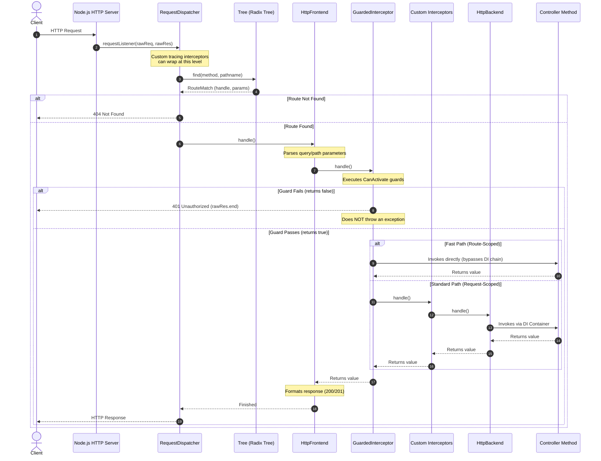

# Holu REST Request Lifecycle & Workflow

This skill explains how incoming HTTP requests are processed in `@holu/rest`, the sequence of interceptors and guards, controller scopes, and error handling.

## Request Lifecycle Overview

1. **Entry Point (`RequestDispatcher`)**: Node.js raw requests hit `RequestDispatcher.requestListener`. It extracts the pathname/query, normalizes `HEAD` to `GET` (using `HeadStrategy` / `NullBodyResponse` to discard the body later), and calls the router.
2. **Route Matching (`Tree`)**: Uses Holu's internal Radix Tree router (`Tree`) to match the route. If not found, calls `sendNotFound()`.
3. **Interceptor Pipeline**:
   - **`HttpFrontend`**: Parses path/query params into the context. On the way back, formats the response and status code (GET: 200, POST: 201).
   - **`GuardedInterceptor`**: Executes `@guard()` CanActivate guards.
   - **Custom `HTTP_INTERCEPTORS`**: Custom interceptors (e.g. from `@route(..., interceptors)`) execute next.
   - **`HttpBackend`**: Terminal handler delegating to the controller method.
4. **Controller Method**: Executes business logic and returns a value back up the interceptor chain.

## Error Handling & Guard Failure Flow

- **Guard Failure**: If a guard returns `false`, it does **not** throw an error. It directly writes `401 Unauthorized` to the response and ends it (`ctx.rawRes.end()`). Guards can also return a Web API `Response` object (e.g., `new Response(null, { status: 403 })`), which Holu writes directly to the client without throwing.
- **Exception Handling**: If a controller or interceptor throws an unhandled error/rejection, it propagates to the outer handler and is caught by `HttpErrorHandler.handleError(err, ctx)`. Unhandled routing errors fall back to `RequestDispatcher.sendInternalServerError()`.

## Controller Scopes (Crucial for Performance)

Holu supports two execution modes for controllers:

### 1. Request-Scoped (Default: `@controller()`)
- The controller is instantiated per request.
- Method arguments are resolved via DI (e.g. `@route('GET') getHello(service: MyService, ctx: RequestContext)`).
- `RequestContext` is injected, which provides access to `req`, `res`, `pathParams`, etc.

### 2. Route-Scoped (`@controller({ scope: 'route' })`)
- A singleton controller instantiated once per module/route.
- Method receives a single argument: `ctx: RouteContext`. DI injection via method parameters is not possible; you must use constructor injection or extract values from `ctx`.
- Noticeably faster (15-20%) as it avoids per-request DI container allocation.
- If a route has no guards and no custom interceptors, it uses a fast path (`handleWithoutInterceptors`), bypassing chain creation entirely.

> [!TIP]
> `RequestContext` and `RouteContext` both inherit from `BaseRequestContext`. Use `BaseRequestContext` when typing custom `HttpInterceptor` contexts to support both controller scopes.

## Critical Rules for AI Agents

1. **Do Not Place Tracing Interceptors in `HTTP_INTERCEPTORS` if they must cover Guards**: 
   Since `GuardedInterceptor` is hardcoded early in the chain, custom `HTTP_INTERCEPTORS` run *after* guards. To wrap the whole request (including routing and guards) in a telemetry span, override `RequestDispatcher` at `providersPerApp`.
2. **Resolve DI Collisions**: 
   Overriding `RequestDispatcher` causes a collision with `RestModule`. Resolve it via `@restRootModule({ resolvedCollisionsPerApp: [[RequestDispatcher, CustomTelemetryModule]] })`.
3. **Route-Level Interceptors**: 
   `@route(httpMethod, path?, guards?, interceptors?)` accepts an array of interceptor classes, which are automatically added to the chain for that route.
4. **Guards Definition**: 
   Guards must be decorated with `@guard()` (not `@injectable()`).
